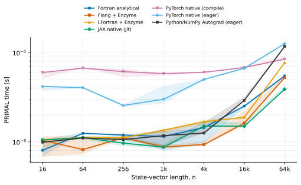
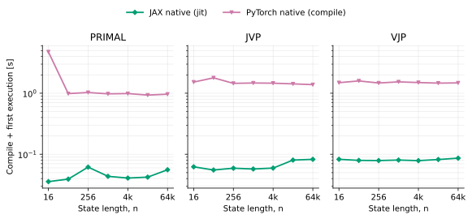
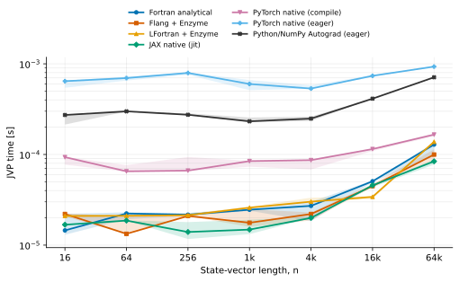
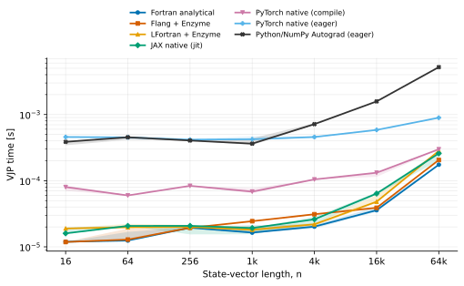
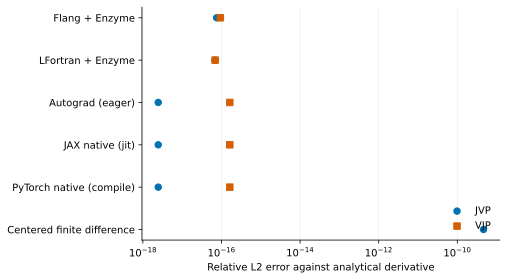
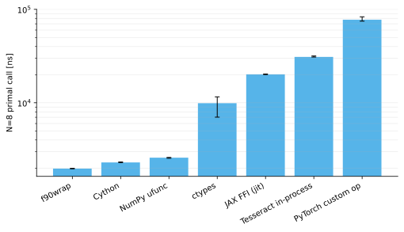

# Differentiable Fortran

This repository answers a practical question: given a numerical model written in
Fortran, which derivative and interoperability path should you choose?

Every implementation advances the same one-dimensional heat equation by one time
step. The repository keeps the mathematics, inputs, outputs, validation cases, and
benchmark protocol fixed. You can therefore compare derivative engines and Python
interfaces without also changing the problem.

## Pick a solution

| You need | Start here | What stays in the hot path |
|---|---|---|
| A Fortran application with generated derivatives | [Flang + Enzyme](solutions/flang-enzyme) | Fortran compiled by Flang, Enzyme-generated derivative |
| The same pipeline with LFortran | [LFortran + Enzyme](solutions/lfortran-enzyme) | Fortran compiled by LFortran, Enzyme-generated derivative |
| A readable correctness and performance reference | [Analytical Fortran](solutions/analytic-fortran) | Hand-derived Fortran JVP or VJP |
| A modern object-oriented Fortran API in Python | [f90wrap](solutions/f90wrap) | f90wrap exposes the derived type and type-bound procedures |
| A small procedural Fortran API in Python | [ISO C + ctypes](solutions/iso-c-ctypes) | ISO C ABI called through `ctypes` |
| Lower Python call overhead or a custom adapter | [Cython](solutions/cython) | Compiled Cython-to-C/Fortran call |
| A callback used repeatedly inside SciPy | [SciPy LowLevelCallable](solutions/scipy-lowlevel) | SciPy calls the Fortran function pointer directly |
| Element-wise calls from NumPy | [NumPy ufunc](solutions/numpy-ufunc) | A compiled NumPy ufunc loop |
| A compiled JAX program that calls Fortran | [JAX FFI](solutions/jax-ffi) | XLA FFI handler calls the compiled Fortran library |
| A compiled PyTorch program that calls Fortran | [PyTorch custom operator](solutions/pytorch-custom-op) | Registered native operator calls Fortran |
| A service or portable model component | [Tesseract](solutions/tesseract) | Tesseract packages and orchestrates the selected implementation |
| A Python-native baseline | [JAX](solutions/jax-native) or [PyTorch](solutions/pytorch-native) | JAX or PyTorch primitive operations |
| Eager Python/NumPy automatic differentiation | [Autograd](solutions/autograd-native) | Python tracing and NumPy operations on every call |

`ctypes` is deliberately included, but it is not presented as the universal
fastest ISO C interface. A normal `ctypes` call crosses Python on every call. In a
SciPy `LowLevelCallable`, `ctypes` may only be used once to obtain the address; the
integration loop then calls the compiled function directly. Cython, NumPy ufuncs,
JAX FFI, and PyTorch custom operators solve different forms of the same overhead
problem.

## Read from A to B

1. Read [the common contract](docs/contract.md) to understand the primal,
   analytical JVP, and analytical VJP.
2. Use the table above or the [decision guide](docs/decision-guide.md) to select a
   path.
3. Run that solution's README. Each solution builds independently and implements
   the same public operations.
4. Run the correctness suite. Generated and automatic derivatives are compared
   with the analytical derivative, finite differences, and the adjoint identity.
5. Read [the benchmark method](docs/benchmark-method.md) before comparing timings.
6. Reproduce the plots with `benchmark/run.py`; committed figures are reference
   results, not promises about another machine.

For a broader workload comparison, read the
[seven-workload Enzyme README study](studies/enzyme-readme). It repeats the LSTM,
BA, GMM, Euler, RK4, FFT, and Brusselator workload families in C++/Enzyme,
Fortran with both Flang/Enzyme and LFortran/Enzyme, and JAX, with correctness
checks, raw measurements, and log-log scaling plots.

Tesseract is one integration target, not the organizing abstraction of this
repository. It becomes useful when the chosen implementation must be packaged,
served, or orchestrated from another framework. The comparison remains meaningful
without Tesseract.

## What is compared

The derivative comparison separates the cost of the numerical kernel from the
cost of reaching it:

- analytical Fortran JVP and VJP;
- Enzyme applied to LLVM IR emitted by Flang and LFortran;
- native JAX automatic differentiation;
- native PyTorch automatic differentiation;
- eager Python/NumPy automatic differentiation with Autograd;
- primal, derivative, first-call, steady-state, and interface-call timings;
- accuracy against the analytical derivative.

The interface comparison includes ISO C plus `ctypes`, f90wrap for a modern
object-oriented Fortran API, Cython, SciPy `LowLevelCallable`, a NumPy ufunc,
`jax.ffi`, a PyTorch custom operator, and Tesseract. Rich Fortran APIs and minimal
C ABIs are separate design choices: the former is convenient for users, while the
latter is a stable substrate for performance-sensitive integrations.

## Build the common Fortran reference

```console
fo
cmake -S . -B build -G Ninja
cmake --build build
ctest --test-dir build --output-on-failure
```

The Enzyme solutions require matching LLVM, compiler, and Enzyme versions. See
[the toolchain notes](docs/toolchains.md) for exact commands and diagnostics.

## Benchmark figures

Reference figures are generated from the raw files in
[`benchmark/results/reference`](benchmark/results/reference) and committed under
[`benchmark/figures`](benchmark/figures). They were collected on a consumer
x86-64 workstation
with Flang 22.1.6, LFortran `0.58.0-4615-g2d1afed24`, Enzyme for LLVM 22,
Autograd 1.9.1, JAX 0.10.2, and PyTorch 2.13.0. See
[the machine-readable manifest](benchmark/results/reference/manifest.json) and
[benchmark method](docs/benchmark-method.md) before comparing the values with
another machine.



At `n=65,536`, median primal times were 54.83 µs for analytical Fortran,
52.54 µs for Flang Enzyme, 77.10 µs for LFortran Enzyme, 38.90 µs for JAX JIT,
84.45 µs for compiled PyTorch, 125.96 µs for eager PyTorch, and 117.32 µs for
eager Python/NumPy Autograd. The JVP and VJP figures retain the analytical
derivative as a timed implementation rather than using it only for validation.

Compilation is excluded from those steady-state values. The separate startup
plot records compile plus first execution after clearing the relevant cache. At
`n=65,536`, JAX took 0.056, 0.083, and 0.086 seconds for the primal, JVP, and VJP;
PyTorch Inductor took 0.965, 1.383, and 1.477 seconds.

On this run, compiled PyTorch amortized its startup cost relative to eager
PyTorch after roughly 23,000 primal calls, 1,800 JVP calls, or 2,500 VJP calls at
this size. The break-even point follows directly from the committed startup and
steady-state measurements and will change with the model and machine.







At `n=65,536`, eager Python/NumPy Autograd took 5.20 ms for the VJP, compared
with 0.175 ms for analytical Fortran, 0.258 ms for JAX JIT, and 0.299 ms for
compiled PyTorch. This eager series includes tracing and tape construction on
every derivative call.

The generated and framework derivatives agree with the analytical formulas near
binary64 rounding error. The centered finite-difference JVP is about six orders of
magnitude less accurate in this case.



The interface plot measures one `n=8` primal call. f90wrap reuses its output array;
Cython, the ufunc, and `ctypes` allocate outputs. JAX reuses device inputs, and
PyTorch reuses tensor inputs. Those policies are recorded in the raw timing table.



Reproduce all data and figures with:

```console
benchmark/reproduce-reference.sh
```

## License

The repository is licensed under Apache-2.0. Dependencies retain their own
licenses; see [THIRD_PARTY.md](THIRD_PARTY.md). Repository files adapted from
Apache-2.0 examples remain under this repository-wide Apache-2.0 license and carry
the required attribution in `NOTICE`.
