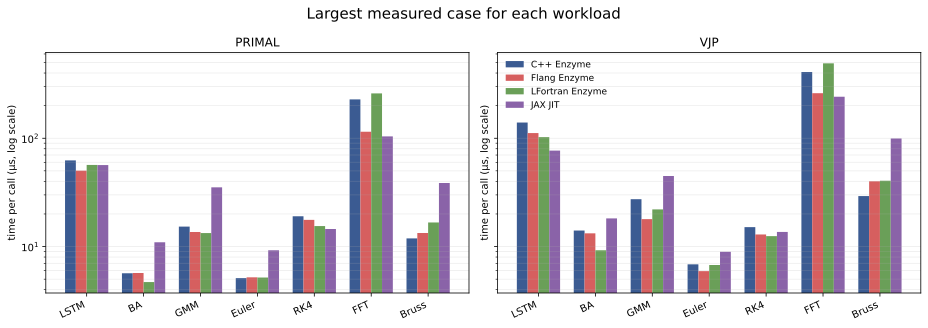
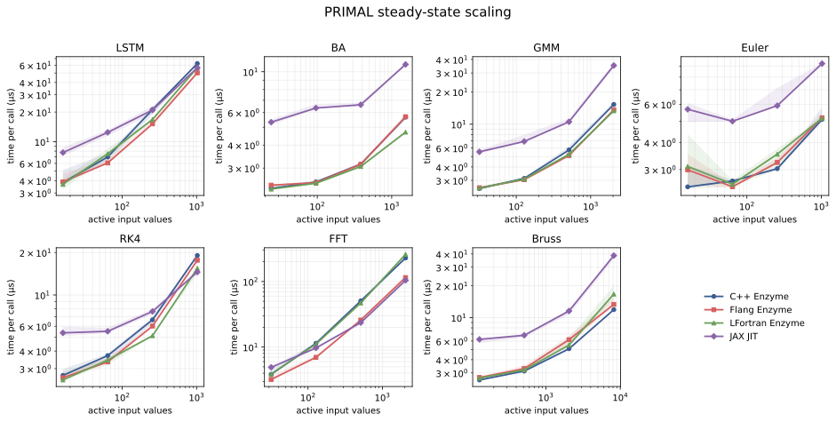
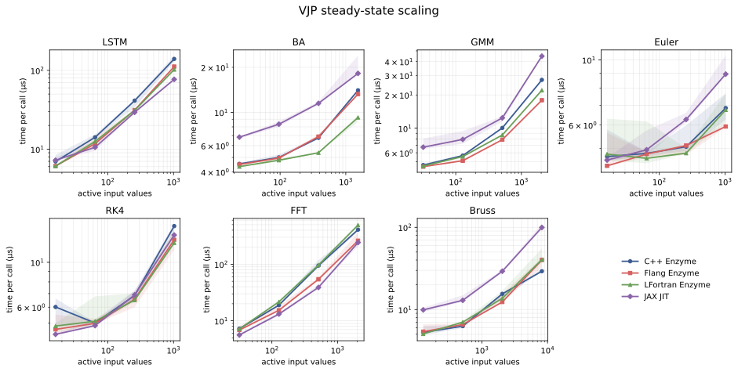
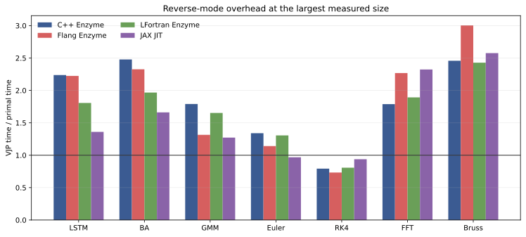
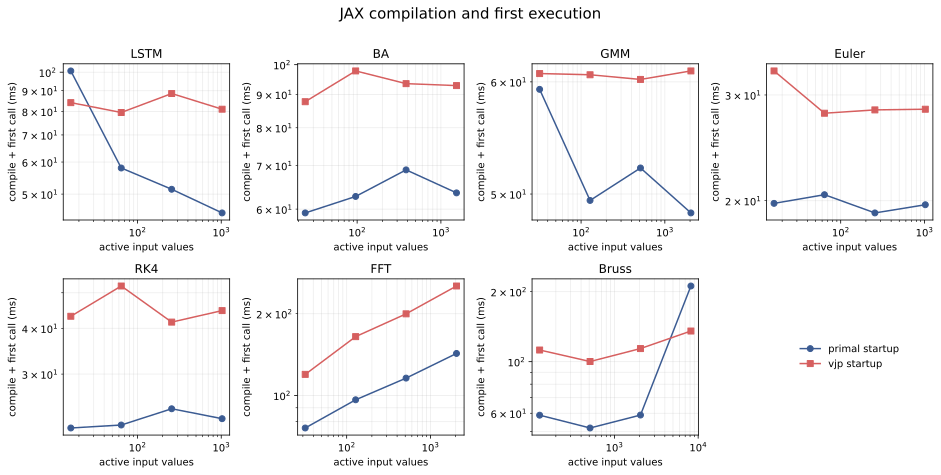
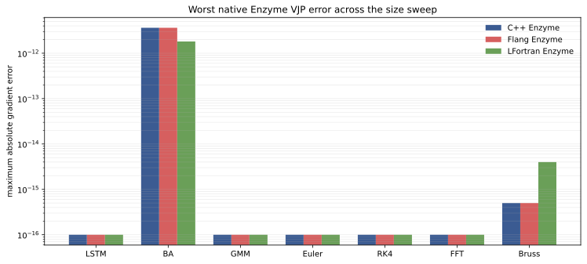

# The seven Enzyme README workloads in C++, Fortran, and JAX

The benchmark image in the Enzyme README compares seven workloads: LSTM,
bundle adjustment (BA), Gaussian mixture models (GMM), Euler integration, RK4,
FFT, and a two-dimensional Brusselator (Bruss). This study implements all seven
under one contract and runs four derivative pipelines:

- C++ compiled with Clang and differentiated by Enzyme;
- the same numerical contract in Fortran, compiled by Flang and differentiated
  by Enzyme;
- the Fortran source compiled by LFortran and differentiated by Enzyme;
- a JAX translation compiled on the CPU and differentiated with `jax.grad`.

The result is not a digitization of the old speedup bars. It is a new binary64
measurement on one machine, with current compilers, common inputs, and checks of
every generated gradient.



At the largest measured size, no pipeline wins every workload. JAX has the
fastest FFT primal and VJP, the fastest LSTM VJP, and the fastest RK4 primal.
Flang has the fastest LSTM primal and the fastest GMM and Euler VJPs. LFortran is
fastest for the BA and GMM primals and the BA and RK4 VJPs. C++ has the fastest
Euler and Brusselator primals and the fastest Brusselator VJP. Differences
smaller than the run-to-run spread should not be treated as an ordering.

## What the old Enzyme plot measured

The [current Enzyme README](https://github.com/EnzymeAD/Enzyme#performance)
still displays the benchmark figure from the
[NeurIPS 2020 Enzyme paper](https://proceedings.neurips.cc/paper/2020/hash/9332c513ef44b682e9347822c2e457ac-Abstract.html).
LSTM, BA, and GMM came from ADBench; the remaining cases exercised Boost Odeint
and an FFT implementation. Its values are geometric means normalized so that
Enzyme equals one. They are not execution times.

`Ref` in that plot is the conventional differentiate-then-optimize ordering. The
Enzyme pipeline can optimize the primal IR before creating the derivative and
then optimize the generated derivative. The red crosses report that the tested
Tapenade configuration did not support Euler, RK4, or FFT. This study does not
invent new Tapenade or Adept numbers: it compares the C++/Enzyme form with our
Fortran/Enzyme and JAX forms.

The source inventory is pinned to commit
[`9fa1579`](https://github.com/EnzymeAD/enzyme-benchmarks/tree/9fa1579296b28d9642f8b69a6fffb753211c3f88)
of `EnzymeAD/enzyme-benchmarks`, which is the revision fetched by Enzyme's current
CMake configuration. The benchmark repository has no repository-level license.
Its ADBench-derived LSTM, BA, and GMM source files carry Microsoft MIT headers;
several ODE and FFT files carry no file-level license header. No upstream source
file is copied into this Apache-2.0 repository.

## Common contracts

Each implementation evaluates the same scalar objective and differentiates it
with respect to every value in the input array. Sizes change the amount of work,
not the mathematical constants or generated data.

| Label | Controlled workload | Size `n` | Active values |
|---|---|---:|---:|
| LSTM | recurrent sigmoid/tanh cell and sequence loss | steps | `n` |
| BA | Rodrigues rotation, projection, radial distortion, residual | observations | `3n` |
| GMM | four-dimensional, four-component log likelihood | samples | `4n` |
| Euler | fixed-step linear ODE with an active forcing sequence | steps | `n` |
| RK4 | classical fourth-order integration of the same ODE | steps | `n` |
| FFT | radix-2 complex butterfly and spectral objective | complex values | `2n` |
| Bruss | five-point 2D Brusselator spatial operator | grid width | `2n²` |

These are size-controlled forms of the seven published workloads. They are
not byte-for-byte builds of the 2020 executables. In particular, the GMM fixes
the dimensions and component count, the ODE cases use an active forcing
sequence, and the Brusselator measures the differentiated spatial operator. The
contracts are kept identical across languages so a timing difference is not also
a change in the differentiated function.

The C++ and Fortran FFTs execute the forward butterfly in place, evaluate the
objective, and execute the inverse butterfly to restore the input. JAX expresses
the same stages functionally. `n` must be a power of two and the committed sweep
stops at 1,024.

## Scaling

Each point is the median of nine independently timed samples. A sample contains
enough repeated calls to exceed 30 ms; the translucent interval is the 25th to
75th percentile. Both axes are logarithmic. The horizontal coordinate is the
number of active binary64 input values, which makes the `2n²` Brusselator state
comparable with the vector workloads.





The native timings cross the shared-library boundary through `ctypes`, and the
JAX timings include Python dispatch plus `block_until_ready()`. Inputs and loaded
libraries are reused. The VJP timing includes zeroing the native gradient array;
JAX returns a new gradient buffer. Compilation is excluded from these
steady-state plots.

## Reverse-mode overhead

The ratio below uses the median VJP and primal time at the largest size in each
workload. A ratio below one is possible when the compiler eliminates primal work
that is not needed by the scalar derivative.



## Compilation and first execution

JAX specializes each primal and gradient to one shape. This plot clears that
distinction from steady-state execution by reporting compilation plus the first
synchronous call separately. Both axes are logarithmic.



The native libraries are compiled once by `build.sh`. Their complete build time
is not mixed into a function call because it creates all workloads and sizes in
one library; compiler commands and versions are retained in the scripts and
manifest.

## Accuracy

Before timing a case, the harness compares the three native primals and VJPs with
the JAX binary64 result. Across the committed sweep, the largest absolute VJP
difference is `3.64e-12`; the largest relative difference is `4.75e-12`.



JAX is an independent AD implementation here, not an analytical derivative.
Finite differences are also unsuitable as the sole oracle at the largest active
dimensions. Agreement among independently lowered C++, Flang, LFortran, and JAX
derivatives catches translation and ABI errors while retaining rounding-level
tolerances.

## Reproduce the study

Install the repository's full Python environment and provide Enzyme built for
the installed LLVM major version. The defaults match the reference machine:

```console
uv sync --all-extras
studies/enzyme-readme/reproduce.sh
```

Override `CLANG`, `FLANG`, `LFORTRAN`, `OPT`, `LLVM_LINK`, `ENZYME_PLUGIN`, or
`BUILD_DIR` when the toolchain is elsewhere. The LFortran path rewrites four
generated-IR symbol names (`log`, `sin`, `cos`, and `tanh`) from LFortran runtime
wrappers to their standard C math symbols. This exposes operations that Enzyme
already knows how to differentiate; it does not change the numerical kernel.

Committed measurements and plots live in:

- [`results/reference/timings.csv`](results/reference/timings.csv): every timing
  sample;
- [`results/reference/accuracy.csv`](results/reference/accuracy.csv): every
  cross-pipeline error check;
- [`results/reference/manifest.json`](results/reference/manifest.json): machine,
  versions, environment, and pinned upstream revision;
- [`figures`](figures): SVG and PNG output generated by `plot.py`.

The reference run used one CPU thread on an AMD Ryzen 9 5950X. Frequency scaling,
shared-library layout, LLVM releases, and JAX/XLA versions can all change the
ordering. Rerun the raw harness before choosing a pipeline for a different model
or machine.
